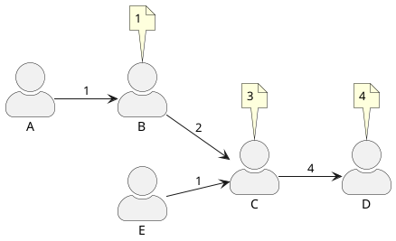
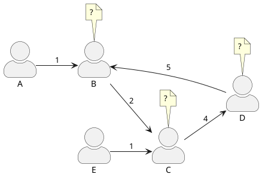
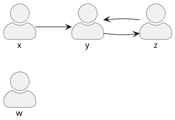

---
presentation:
    slideNumber: true
    progress: false
    enableSpeakerNotes: true
---

<!-- slide -->
### sistema de votación representativa sobre Quorum
@import "quorum.jpg" {width="25%"}

**un primer enfoque**

Diplomante: Andy Ledesma García
Tutor: Yaidir Mustelier Ruiz

<small>https://MakeMake23.github.io/blockchain/thesis/1st-approach/index.html</small>

<!-- slide -->
### Votación representativa 

- sólo es permitido un voto por persona
- voto transferible:
  poder de voto = poder voto entrante + 1

<!-- slide -->
### Votación representativa 

¿qué hacer con los ciclos?

<!-- slide data-notes="veamos las propiedades d f para tener claras las caracteri'sticas d la votacio'n"-->
### relación de voto
$ \langle x, y \rangle \in f \Leftrightarrow x \text{ votó por } y $

$ f = \{ \langle x, y \rangle, \langle y, z \rangle, \langle z, y \rangle \} $

✅función ❌total ❌inyectiva ❌sobreyectiva ✅irreflexiva ❌simétrica ❌asimétrica ❌antisimétrica ❌transitiva

<!-- slide data-notes="los arcos esta'n determinados por f"-->
### digrafo de votación
$ G = \langle V, f \rangle,\; V := \text{votantes} $

1. $out(v) \leq 1, \forall v \in V $ 
2. si $v$ es un vértice de un ciclo $c$, entonces $\langle v, f(v) \rangle$ es un arco de $c$
<!-- 3. si en $G$ hay dos ciclos $c_1$ y $c_2$ con un ve'rtice en comu'n, entonces $c_1 = c_2$ -->
<!-- 4. si $in(v) \neq 0, \forall v \in V$ entonces todo ve'rtice pertenece a un ciclo -->

<!-- slide data-notes="vamos a emplear una modificacio'n del bfs q permite q le establezcan varios ve'rtices iniciales. Acepta la cola como entrada. habla d q en el for v pertenece a un ciclo xq nadie d los q falta x visitar tiene indeg = 0. D los nodos q kedan cuan2 c ejecuta el ciclo, no c puede llegar a un nodo visitado (no existe arco de salida de un ciclo). Esto u'ltimo significa q lo q c decida hacer con los ve'rtices q c encuentran en un ciclo no afectara' a los restantes ve'rtices cuan2 d voto c habla"-->
### implementación 
@import "code.py" {class="line-numbers" line_end=18}

<!-- slide data-notes="v es el u'nico adyacente a u"-->
@import "code.py" {line_end=45 line_begin=27 class="line-numbers"}

<!-- slide data-notes="cycle_found sigue los enlaces d salida para extraer el ciclo encontrado. Esto es posible gracias a la propiedad 2 mencionada anteriormente: el arco (v, f(v)) esta' en el ciclo. Este notify_cycle() le asigna a todos los ve'rtices del ciclo el mayor conteo calculado de algunos d esos ve'rtices. Idea: hacer otro contrato inteligente q c encargue d la implementacio'n d notify_cycle"-->
@import "code.py" {line_end=55 line_begin=47 class="line-numbers"}
¿qué hacer en `notify_cycle()`?
propuesta:
@import "code.py" {line_end=61 line_begin=57 class="line-numbers"}

<!-- slide -->
### detalles
- se permite la abstención 
- se permite el cambio de voto al llamar de nuevo a `make_vote()` con otro valor de `y` <!-- @audit en realidad hay q hacer 1ro modificaciones al make_vote() pa desmarcar de indeg0 a la antigua eleccio'n d x en caso d q se haya kedao sin votantes -->
- no se calculan los resultados hasta el fin de la votación (**justeza**) 

<!-- slide data-notes="para responder la 1ra pregunta c indago' sobre los sistemas electorales existentes y resulta q en los mayoritarios a veces es necesaria una 2da vuelta, la cual puede ser otra eleccio'n, pero esta vez de pluralidad, o emplean2 me'todos como el desempate instanta'neo o votacio'n contingente q c utilizan en sistemas d ranking y q no necesitan una 2da vuelta"-->
### pendientes
- ¿cómo decidir ganador cuando hay más de una persona con la mayor cantidad de votos?
- ¿*Hyperledger Besu* o *GoQuorum*?