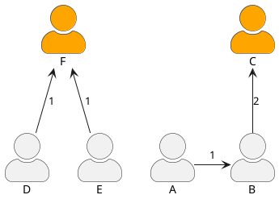

---
export_on_save:
    puppeteer: ["pdf"]
puppeteer:
    height: "3.3in"
    width: "4.4in"
    pageRanges: "1"
---

```puml
@startuml
skinparam actorStyle awesome

:A: -right-> :B: : 1
:B: -up-> :C: : 2


component :C: #Orange

:D: -up-> :F: : 1
:E: -up-> :F: : 1


component :F: #Orange

@enduml
```