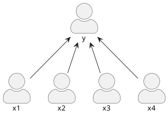

---
export_on_save:
    puppeteer: ["pdf"]
puppeteer:
    width: "4in"
    height: "2.9in"
    pageRanges: "1"
---

```puml
@startuml
skinparam actorStyle awesome

:x1: -up-> y
:x2: -up-> y
:x3: -up-> y
:x4: -up-> y

@enduml
```