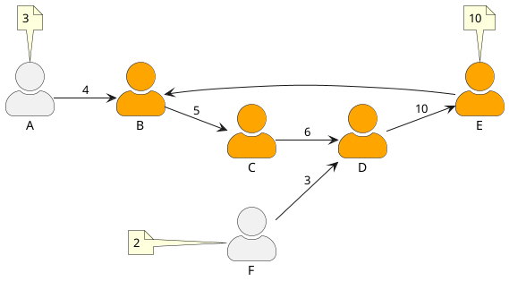

---
export_on_save:
    puppeteer: ["pdf"]
# puppeteer:
#     height: "3.1in"
#     width: "4in"
#     pageRanges: "1"
---

```puml
@startuml
skinparam actorStyle awesome
left to right direction

:A: --> :B: : 4
:B: --> :C: : 5
:C: --> :D: : 6
:D: --> :E: : 10
:E: --> :B:
:F: --> :D: : 3

note top of A: 3
note left of F: 2
note top of E: 10

component :E: #Orange
component :B: #Orange
component :C: #Orange
component :D: #Orange

@enduml
```