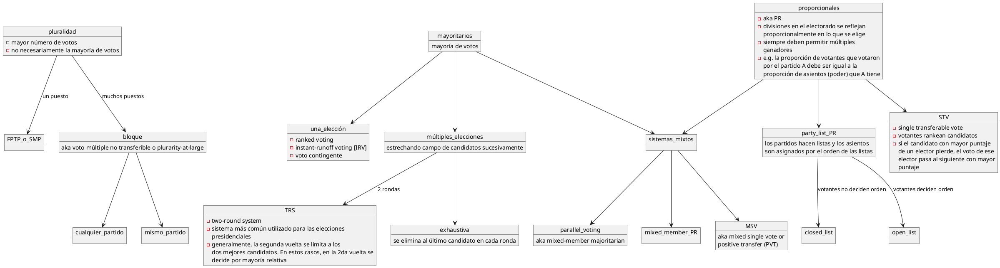

[de wikipedia](https://en.wikipedia.org/wiki/Electoral_system):

```puml
@startuml

object pluralidad {
    - mayor número de votos
    - no necesariamente la mayoría de votos
}
object FPTP_o_SMP {
}
object bloque {
    aka voto múltiple no transferible o plurarity-at-large
}
object cualquier_partido {
}
object mismo_partido {

}
pluralidad --> FPTP_o_SMP : un puesto
pluralidad --> bloque : muchos puestos
bloque --> cualquier_partido
bloque --> mismo_partido

object mayoritarios {
    mayoría de votos
}
object una_elección {
    - ranked voting 
    - instant-runoff voting [IRV]
    - voto contingente
}
object múltiples_elecciones {
    estrechando campo de candidatos sucesivamente 
}
object TRS {
    - two-round system
    - sistema más común utilizado para las elecciones 
    presidenciales
    - generalmente, la segunda vuelta se limita a los 
    dos mejores candidatos. En estos casos, en la 2da vuelta se 
    decide por mayoría relativa
}
object exhaustiva {
    se elimina al último candidato en cada ronda
}
mayoritarios --> una_elección
mayoritarios --> múltiples_elecciones 
múltiples_elecciones --> TRS : 2 rondas
múltiples_elecciones --> exhaustiva

object proporcionales {
    - aka PR
    - divisiones en el electorado se reflejan 
    proporcionalmente en lo que se elige
    - siempre deben permitir múltiples 
    ganadores
    - e.g. la proporción de votantes que votaron
    por el partido A debe ser igual a la
    proporción de asientos (poder) que A tiene
}

object party_list_PR {
    los partidos hacen listas y los asientos
    son asignados por el orden de las listas
}

object closed_list {
    
}

object open_list {
    
}

object STV {
    - single transferable vote
    - votantes rankean candidatos
    - si el candidato con mayor puntaje 
    de un elector pierde, el voto de ese
    elector pasa al siguiente con mayor 
    puntaje
}

proporcionales --> party_list_PR
party_list_PR --> open_list : votantes deciden orden
party_list_PR --> closed_list : votantes no deciden orden
proporcionales --> STV

object sistemas_mixtos {

}

object parallel_voting {
    aka mixed-member majoritarian
}

object mixed_member_PR {

}

object MSV {
    aka mixed single vote or 
    positive transfer (PVT)
}

mayoritarios --> sistemas_mixtos
proporcionales --> sistemas_mixtos
sistemas_mixtos --> parallel_voting
sistemas_mixtos --> mixed_member_PR
sistemas_mixtos --> MSV

@enduml
```