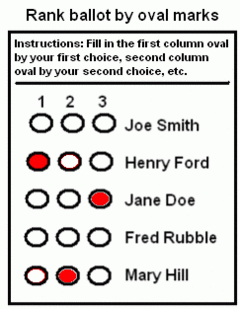
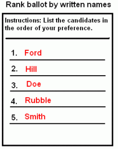
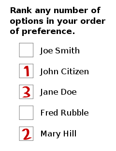

# Introducción
Un sistema electoral o de votación es un conjunto de reglas que dictan cómo debe comportarse una elección y cómo son determinados sus resultados. Entre los aspectos que las reglas deciden están:

- cuándo ocurren las elecciones,
- a quién se le permite votar,
- quién puede ser un candidato,
- cómo las boletas son marcadas y emitidas,
- cómo los votos influyen en los resultados, y
- los límites de los gastos de las campañas.

Las elecciones tradicionales o basadas en papel son ampliamente utilizadas alrededor del mundo para la toma de decisiones. Su empleo destaca en el ámbito político, garantizando durante décadas la preservación de la democracia en muchos países. Sin embargo, este tipo de elecciones puede presentar diversos problemas que causan desconfianza en el electorado. Entre ellos se destacan: [@trustworthy_blockchain]

(@fraude-pre) **fraude pre-electoral:** un ejemplo de ello es cuando intencionalmente se manipulan las listas de candidatos para ocultar a ciertos partidos. Se han detectado también ilegalidades a la hora de confeccionar los distritos de votación, colocando el centro electoral en un  lugar tan distante que los votantes prefieren no ir a votar.
(@) **votos falsos:** en muchos centros electorales no existe una verificación biométrica de la identidad del votante, lo cual permite con relativa facilidad emitir votos en nombre de personas que no han votado. 
(@) **abuso de poder:** las recompensas y las amenazas son empleadas por personas con poder, con el objetivo de coaccionar al votante   para que elija una opción específica.
(@unsupervised-counting) **conteo de votos sin supervisión:** cuando el conteo no es supervisado adecuadamente, es muy probable que no sean contados los votos de algunos partidos.
(@) **falta de auditorías y apelaciones:** las apelaciones y solicitudes de auditorías son procesos tan lentos que difícilmente suceden antes de las elecciones siguientes. Los candidatos afectados suelen entonces llamar a su electorado a protestar y causar disturbios, lo cual provoca inestabilidad política.   

Todas estas situaciones, y otras que se pueden dar en una elección convencional, crean descontento y desconfianza entre los votantes.   

Un sistema de votación electrónico es capaz de  minimizar o solucionar algunos de los problemas mencionados anteriormente. En un sistema *online*, por ejemplo,  no es necesaria la presencia del votante en un lugar específico. Luego, la distancia del votante al centro electoral deja de ser relevante, porque cualquier dispositivo con conexión a Internet es un "centro electoral" y puede estar fácilmente al alcance del elector. Esto minimiza el problema (@fraude-pre). 

Diversas formas de verificación biométrica pueden ser logradas mediante elecciones electrónicas. La verificación de la huella digital y el escáner ocular son ejemplos de ello. 

Mediante un sistema electrónico se pueden contar los votos de manera eficiente mientras se van realizando y se  pueden publicar en vivo los resultados. Esto mitiga el problema (@unsupervised-counting).

Otras bondades poseen los sistemas electrónicos, como son la flexibilidad, lo fácil que pueden ser de usar y lo baratos que son con respecto a los sistemas tradicionales. Sin embargo, muchos de los sistemas electrónicos existentes son centralizados, esto es, dependen de que una agencia central se encargue de registrar, manejar, calcular y revisar los votos. Toda la confianza debe entonces ser depositada en esa agencia, lo cual hace vulnerable al sistema.

Un sistema descentralizado de votación resuelve ese problema. Entre las tecnologías descentralizadas más empleadas actualmente se encuentra *blockchain*. <!--@todo explikr lo q es blockchain --> Existen algunos sistemas de votación electrónicos que emplean *blockchain*, como es @agora,  y muchas propuestas como son   *Open Vote Network* [@ovn] y la de @borda_count. Para poder comparar cada una de esas propuestas, a continuación se muestran los tipos de sistemas electorales que existen y los requisitos que debe cumplir todo sistema de votación electrónico. 

# Tipos de Elecciones

## Sistemas de Pluralidad
Son sistemas donde gana el candidato con el mayor número de votos. En caso de que solo se esté eligiendo un puesto, se conocen como *votación de pluralidad de un solo miembro* (SMP, por sus siglas en inglés) o *first-past-the-post* (FPTP o FPP, por sus siglas en inglés). Si en cambio, se eligen varios puestos, un sistema de pluralidad se conoce como *votación en bloque*, *voto múltiple no transferible* o *pluralidad a gran escala* ("plurality-at-large" en inglés). La votación en bloque puede adoptar dos formas, en dependencia de si se puede votar por miembros de cualquier partido o no.

## Sistemas Mayoritarios
En estos sistemas es necesario que un candidato alcance la mayoría de votos (un determinado porcentaje de los votos) para obtener la victoria. Si esto no sucede, entonces se decide el ganador mediante un *ranking* o en posteriores rondas de votación.

En los sistemas de *ranking*, los electores deben otorgarle un puesto a cada candidato (primero, segundo, tercero, etc.). En la figura \ref{fig:ranking-ballots}, extraída de [Wikipedia](https://en.wikipedia.org/wiki/Ranked_voting), <!--@audit no c si c puede poner el enlace asi' o si hay q ponerlo en las refs--> se muestran ejemplos de boletas de estos sistemas.

{ width=33% }
{ width=33% }
{ width=33% }
\begin{figure}[!h]
\begin{subfigure}[t]{0.30\textwidth}
\caption{Empleando óvalos.}
\end{subfigure}
\hfill
\begin{subfigure}[t]{0.30\textwidth}
\caption{Empleando nombres.}
\end{subfigure}
\hfill
\begin{subfigure}[t]{0.30\textwidth}
\caption{Empleando números.}
\end{subfigure}
\caption{Ejemplos de boletas de los sistemas de {\it ranking}.}\label{fig:ranking-ballots}
\end{figure}

Para determinar el ganador, se utilizan métodos como el *desempate instantáneo* (IRV, por "instant-runoff voting" en inglés) o la *votación contingente*. 

En IRV se cuentan los votos de la primera elección de cada votante. Si un candidato posee más de la mitad de  los votos, entonces gana la elección. En otro caso, se elimina al candidato con menos votos y se le aumenta un voto a la siguiente opción disponible de todos aquellos que hayan elegido al candidato eliminado en primera opción. Esto último puede ser visto como que en toda boleta donde el $i$-ésimo candidato sea el eliminado, el *ranking* se desplaza, esto es, el $(i+1)$-ésimo pasa a ser el $i$-ésimo, el $(i+2)$-ésimo pasa a ser el $(i+1)$-ésimo, etcétera. El proceso continúa hasta que algún candidato obtenga más de la mitad de los votos. 

La figura \ref{fig:irv} muestra el diagrama de flujo de IRV.

{ width=80% }

El método de  votación contingente es similar a IRV, pero posee a lo sumo dos rondas de conteo. En la primera ronda se cuentan los votos de las primeras opciones de todos los votantes. Si algún candidato obtiene más del 50% de los votos, se declara ganador. En otro caso, se eliminan todos los candidatos excepto los dos que más votos tienen en el conteo. Si una primera opción ha sido eliminada de una boleta, entonces los votos de ese votante pasan al candidato disponible (solo hay dos) que más arriba se encuentre en el *ranking* de esa boleta.

En la figura \ref{fig:conting} se muestra el diagrama de flujo del método de votación contingente.

{ width=60% }

A pesar  de lo eficiente que puede resultar emplear un sistema de *ranking*, en la mayoría de los sistemas electorales mayoritarios se realiza una segunda ronda de votación cuando ningún candidato obtuvo el porcentaje acordado en la primera ronda.

Cuando a lo sumo se realizan dos rondas de votación, se conoce como *sistema de dos rondas* (TRS, por "two-round system" en inglés). A la segunda ronda pasan los dos candidatos con más votos y el ganador se decide como en un sistema de pluralidad. Las rondas son independientes una de otras, o sea, un elector pudo haber votado por el candidato $A$ en la primera ronda y luego haber votado por $B$ en la segunda, aún cuando $A$ haya pasado a la segunda ronda también.

Existen sistemas donde en cada ronda se elimina al candidato con menos votos y se realizan rondas hasta que solo quede un candidato, el cual se proclama vencedor. A estos se le conocen como *sistemas exhaustivos*. 

## Representación Proporcional
En los *sistemas de representación proporcional* (conocidos como PR) varios candidatos se proclaman ganadores. La proporción del poder de cada candidato vencedor es igual a la proporción de los votos que el candidato obtuvo. Por ejemplo, si los partidos $A_1$, $A_2$, ..., $A_n$ se están disputando los $N$ puestos de un parlamento, entonces

$$
{v(A_i) \over V} = {s(A_i) \over N}, \quad i = 1, 2, ..., n
$$

donde $v(A_i)$ es la cantidad de votos obtenidos por el partido $A_i$, $V$ es el total de votos y $s(A_i)$ es la cantidad de puestos del partido $A_i$ en el parlamento.

En la variante *party list PR*, cada partido coloca a sus candidatos en orden en una lista y los  "puestos" se asignan respetando ese orden. Si el orden de los candidatos en los partidos es decidido por los propios votantes, entonces se dice que la lista es *abierta*. En otro caso, si el orden es decidido a lo interno del partido, se dice que la lista es *cerrada*. 

Existe otra variante llamada *voto único transferible* (STV, por sus siglas en Inglés). Es un sistema de *ranking* donde los electores votan por candidatos de cualquier partido. El voto de un elector se le asigna a la primera opción de su lista. 

<!-- @audit en muchas ocasiones he esta2 hablan2 como si fuera asi', cuan2 en verdad son familias d algoritmos q vari'an en co'mo toman ciertas decisiones, i.e. en stv no todos hacen lo mismo a la hora d transferir los votos. asi' pasa con otros sistemas tambie'n -->

En cada ronda se elimina al candidato con menos votos, pero los votos asociados a ese candidato no se pierden: si un elector depositó su voto en ese candidato entonces el voto se transfiere al próximo candidato no eliminado  en la lista del votante. Si no existe un próximo candidato, entonces el voto desaparece. 

Antes de comenzar el proceso, se designa una *cuota*. Cuando los votos de un candidato sean mayores o iguales que dicha cuota, entonces se considera elegido y los votos sobrantes (el excedente) no se pierden: si un elector depositó su voto en ese candidato, entonces el voto se transfiere al próximo candidato no eliminado  en la lista del votante, en caso de existir. Si la cantidad de candidatos no eliminados que se encuentran después del candidato ganador en alguna lista es mayor que el excedente, entonces se debe considerar un método que permita distribuir el excedente  proporcionalmente. 

Nótese que cuando no existe un próximo candidato al cual transferir los votos, se procede de manera distinta en dependencia de si el candidato en cuestión perdió o ganó: en el primer caso los votos desaparecen, mientras que en el segundo, permanecen en el candidato.

El proceso termina cuando los $N$ asientos han sido ocupados por candidatos elegidos o cuando la cantidad de asientos libres iguala al número de candidatos todavía en disputa, en cuyo caso se declaran electos a esos candidatos.

Con una cuota justa, mientras más grande sea $N$, más proporcional será la distribución de los $N$ asientos en un STV.<!--@audit justifica o pon ref--> Las cuotas de [Hare](https://en.wikipedia.org/wiki/Hare_quota) y de [Droop](https://en.wikipedia.org/wiki/Droop_quota) <!--@audit enlaces a wikipedia, eso creo q es malo--> son las más usadas. 

##  Sistemas Mixtos
La *votación paralela* es un ejemplo de sistema mixto. En él se eligen una parte de los asientos mediante un método de votación y la otra parte, empleando otro método; por ejemplo, FPTP para una parte y *party-list PR* para la otra. Ambas votaciones se pueden realizar en paralelo porque no deben estar conectadas en ningún sentido.

Otro sistema mixto es el *mixed-member proportional representation*, en el cual cada elector emite dos votos: uno por un candidato para que represente a su distrito electoral y otro por un partido para que lo represente al nivel más alto. Los puestos son asignados primero a los ganadores de cada distrito y luego a los miembros de los partidos, de manera proporcional con respecto a la cantidad de votos. De esta forma, se ejecutan dos tipos de votaciones: una donde gana un solo candidato (generalmente una votación de pluralidad) y otra donde se utiliza un método de representación proporcional.

En un sistema de *voto único mixto* (MSV) también se vota por un candidato para el distrito y por un partido para un nivel más alto, pero cada elector sólo emite un voto. Dicho voto va primeramente para el candidato que el votante desea que lo represente a nivel de distrito. Si ese voto es "malgastado", esto es, el voto pertenece a un candidato que pierde o forma parte del excedente de un candidato que gana, entonces el voto va para un partido afiliado a ese candidato. Un sistema MSV está compuesto entonces por un sistema de representación proporcional que se alimenta (sus votos provienen) de un sistema de pluralidad o mayoritario. Los puestos son asignados como en los *mixed-member PR*.

# Sistemas de Voto Electrónico
## Requisitos 
En la siguiente sección se muestran los requisitos principales  que debe cumplir todo sistema de votación electrónico. Adicionalmente, se presentan otros requisitos opcionales que contribuyen a aumentar la calidad del sistema [@wang2017review].

### Principales 
- Correctitud: los votos deben ser contados correctamente. Para ello, dos propiedades deben satisfacerse:
    - totalidad: todos los votos v&aacute;lidos deben ser contados.
    -  robustez: los votos no autorizados o inv&aacute;lidos no deben ser contados.
    
- Privacidad: no se conoce la decisi&oacute;n del votante.
- Prevenci&oacute;n del doble voto: un votante no puede emitir la misma boleta dos veces. También se debe evitar que un tercero pueda clonar una boleta previamente emitida por un votante, para registrarla de nuevo a nombre de ese votante.
- Elegibilidad: solo los votantes autorizados pueden votar.
- Robustez: poder lidiar con una cierta cantidad de comportamientos incorrectos por parte de los votantes o con una falla parcial del sistema (un sistema distribuido resiste mejor este tipo de fallas). 
- Verificabilidad individual: el votante debe poder verificar que su voto haya sido contado.
- Usabilidad: se le debe facilitar a los usuarios del sistema la utilización de este a lo largo del proceso de votación, auditoría y consulta. El usuario debe poder lograr su cometido con la menor cantidad de recursos y la mayor satisfacción posibles. 

### Adicionales
- Justeza: no se calculan los resultados hasta el fin de la votaci&oacute;n.
- Incoercibilidad: evitar la coerción (e.g. votación en cadena o *chain voting* [@chain-voting]).
- Eficiencia: el sistema debe responder con rapidez ante una gran cantidad de votantes y elecciones.
- Movilidad: se puede votar desde dispositivos móviles.
- *Vote-and-Go:* que se pueda votar *offline* una vez la boleta haya sido emitida.
- Verificabilidad universal: cualquier persona puede verificar que los votos hayan sido contados correctamente.
- Verificabilidad de extremo a extremo (*end-to-end* o E2E): al votante se le entrega un recibo que demuestra que votó, pero no indica cuál fue su decisión. <!--@audit agora es e2e-verificable sin embargo no entrega recibo-->

## Agora
Agora es un sistema de votación basado en *blockchain* desarrollado por la compañía homónima con sede en Suiza. Está destinado a gobiernos e instituciones [@agora].

En él se pueden realizar elecciones mayoritarias y STV.

<!-- arquitectura skipchain desarollada x ellos mismos. el bulletin board es como le llaman a su blockchain y la info d ahi' esta' atada a la blockchain d btc a trave's de la capa Cotena -->

Las boletas se encriptan con el umbral de ElGamal [@elgamal-threshold] <!--@todo ta denso lo q dice ese paper, verifica si esta' bien--> para garantizar la **privacidad**. Ni siquiera Agora tiene acceso a la información del usuario, mucho menos al contenido de la boleta. Cuando terminan las votaciones, todas las boletas se pasan por una **red de mezcla** (*mixing network*) para hacerlas anónimas, al punto de que es despreciable la probabilidad de que alguien sepa qué votante emitió un voto particular. Al votante no se le entrega un recibo, por lo que no  puede probarle a un tercero cuál fue su elección [@agora].

Agora no posee un mecanismo propio para autenticar los votos, en cambio, depende de que los administradores de la red seleccionen un sistema de manejo de identidades. <!--@note esto es eligibilidad-->

<!-- @audit valora la opcio'n d poner el te'rmino bulletin board en espanyol -->

Con respecto a los errores, Agora los detecta, los reporta a los auditores y los almacena en el propio sistema. Cuando los auditores <!--@audit sería bueno decir kiénes son los auditores-->resuelven el conflicto publican el resultado en el *bulletin board*\footnote{Así Agora llama a su \textit{blockchain}.} [@agora]. Por otro lado, el sistema es capaz de soportar un número limitado de [fallas bizantinas](https://es.m.wikipedia.org/wiki/Tolerancia_a_faltas_bizantinas). <!--@audit url a wikipedia --> Todo esto contribuye a la  **robustez** de Agora. 

Agora posee **verificabilidad individual**, ya que el votante puede verificar que su boleta encriptada refleja su intención de voto, mediante una validación *cast-or-challenge* [@agora]. Los votantes también pueden  verificar que su voto ha sido registrado correctamente (*collected-as-cast validation*). 

Una de las capas en la arquitectura de Agora es la red Valeda, la cual está formada por los nodos auditores. Estos nodos se encargan de validar los resultados de la elección, los cuales se encuentran almacenados en el *bulletin board*. Cualquiera en el mundo puede correr un nodo auditor y, por ende, verificar una elección en Agora. Por otro lado, cada cierto tiempo se almacena una copia del estado del *bulletin board* en la *blockchain* de Bitcoin. Todo esto contribuye a que Agora sea un sistema **verificable universalmente**. 

Cada paso intermedio en el proceso de elección es registrado en la *blockchain* de Agora, lo cual permite una **verificación de extremo a extremo**. <!--@audit no coincide con la definicio'n --> Esta verificación es fácilmente alcanzable mediante *Audit*, una aplicación desarrollada por Agora. 

Una vez  se descarga la información del *bulletin board*, se puede inspeccionar la elección totalmente **offline**. Un dispositivo no necesita muchos recursos para validar.

Con respecto a la **usabilidad**: cualquier votante sin conocimientos técnicos puede emitir y verificar un voto.

Además de poder votar desde una PC o una máquina de votación, también se puede votar desde un dispositivo móvil.

## *Open Vote Network*
*Open Vote Network* es un protocolo de dos vueltas para votaciones de pequeña escala. En la primera ronda el votante se registra y en la segunda  emite su voto.  Está pensado para **sistemas de pluralidad** de dos opciones pero se puede extender para múltiples opciones [@ovn]. En @ovn se presenta una implementación de este protocolo mediante contratos inteligentes en Ethereum.

Sea $g$ un generador de un grupo finito cíclico de orden primo $q$ en el cual no se puede tratar el [problema de decisión de Diffie-Hellman (DDH)](https://en.wikipedia.org/wiki/Decisional_Diffie%E2%80%93Hellman_assumption).<!--@audit wiki link--> El proceso de votación posee dos partes fundamentales: 

1. cada elector publica su llave de votación $g^{x_i}$, donde $x_i$ es un número aleatorio de $\mathbb{Z}_q$. Luego, el votante $i$-ésimo calcula 
   
   $$
   Y_i = {b_i \over a_i}, \quad 1 \leq \forall i \leq n,
   $$
   donde
   $$
   b_i = \begin{cases}
    1 &\text{si } i = 1 \\
    \prod_{j=1}^{i-1} g^{x_j} &\text{si } 1 < i \leq n
   \end{cases} \quad \text{ y } \quad 
   a_i = \begin{cases}
    \prod_{j=i+1}^{n} g^{x_j}  &\text{si } 1 \leq i < n \\
    1 &\text{si } i = n  
   \end{cases}
   $$

2. el votante publica su voto. Este paso consiste en emitir el número $(Y_i)^{x_i} g^{v_i}$, donde $v_i$ es 0 si el voto es NO o 1 si es SÍ.

Dado que  los valores de $g^{x_i}$ y $(Y_i)^{x_i} g^{v_i}$ son públicos para toda $i$, no existe un algoritmo polinomial para calcular $x_i$, ya que DDH es intratable en el grupo del cual $g$ es generador. Luego, no es posible que el votante $j$-ésimo, con $j \neq i$, sea capaz de calcular el valor de $v_i$ en tiempo polinomial, a menos, claro está, de que se conozcan los votos de los restantes votantes luego del conteo total. De esta forma OVN logra la **privacidad**.

<!-- el conteo d los votos lo hac el propio sistema -->

Junto con el voto, el votante también publica una [*prueba de cero conocimiento*](https://en.wikipedia.org/wiki/Zero-knowledge_proof)  para probar el valor de $v_i$ y la identidad del votante.  De esta forma se evita el **doble voto**.

El administrador configura cuáles son los votantes autorizados y el contrato impide que otros voten (**elegibilidad**).

El sistema es resistente a los [ataques de reingreso](https://hackernoon.com/hack-solidity-reentrancy-attack). Por otro lado, existe la posibilidad de que la mayoría de los mineros eviten el registro de un votante, aun cuando este haya emitido la orden de registro a tiempo, por lo que se requiere que los votantes se registren razonablemente antes del tiempo límite.  De esa manera se caracteriza la **robustez** del sistema.

Cualquiera puede contar los votos. El votante puede verificar que su voto haya sido registrado y emitido correctamente, mediante la inspección de la *blockchain* y desencriptando su voto con su llave privada. De esta manera, el sistema alcanza la **verificabilidad individual y universal**.

En lo que respecta a la **usabilidad**, los votantes necesitan guardar toda la *blockchain*, aunque es un requisito que puede ser eliminado [@ovn]. Según  @ovn, una elección en la que participen 40 votantes consume en total 145381858 de gas\footnote{Ver definición de gas en \url{https://ethereum.org/en/developers/docs/gas/}.}. A precio actual\footnote{28 de Julio del 2022, 11:39 am.}, eso trae un costo aproximado de    $14406, de los cuales $1232 recaen sobre el administrador y el resto sobre los votantes, promediando un costo de $329 por votante, aproximadamente. Es un costo bastante elevado.

No se pueden calcular los votos hasta que todos hayan sido emitidos, por lo que el requisito de la  **justeza** es satisfecho.

El votante le puede probar a otros cuál fue su decisión, mostrándole su llave privada. Por ello, *Open Vote Network* sólo es adecuado en ambientes de poca **coerción**.

Para que el proceso termine exitosamente, es necesario que todos los votantes registrados emitan su voto. Para incentivarlos, se les exige que depositen ether cuando se registran y se les devuelve la misma cantidad cuando emiten el voto. En caso de que abandonen la elección, se puede saber quién lo hizo y excluirlo de una elección posterior. El fondo retenido del votante que abandona puede ser utilizado para recompensar al resto de los votantes por tener que repetir la elección.

<!-- los logs c mandan a la blockchain d btc. Estos logs son snapshots del bulletin board. co'pialo d abajo -->

## Extensión de *Open Vote Network* para Sistemas de *Ranking* con Conteo de Borda
En @borda_count se presenta un protocolo basado en *Open Vote Network* que permite la ejecución de sistemas electorales de ranking que empleen el conteo de Borda [@borda_count]. La implementación se realizó sobre Ethereum mediante contratos inteligentes.

Debido a que este protocolo se basa en OVN, es natural que sus características sean semejantes. El costo de la elección es también de naturaleza elevada. Según  @borda_count, una elección en la que participen 80 votantes con 5 candidatos cuesta, a precio actual\footnote{31 de Julio del 2022, 04:05 pm. 1 ETH $\approx \$1721$. {\it fee} del bloque: 11 gwei. {\it fee} del minero: 1 gwei.}, $1604 para el administrador y $828 para cada votante,  aproximadamente. Es un costo bastante elevado.

<!-- El voto de un individuo sólo puede ser revelado si todo los votantes restantes conspiran [@borda_count]. no existe adversario polinomial q pueda deducir el voto d un votante (depende de q el problema DDH sea intratable) -->

<!-- El **doble voto** no es posible. -->

<!-- Cada uno de los pasos del proceso es públicamente verificable. El conteo de los votos puede ser realizado por un tercero. Por todo esto, podemos decir que el sistema posee **verificabilidad universal**. -->

<!-- la eligibilidad c cumple =. -->

<!-- aki' tambie'n pasa lo d la coercio'n. c recomienda su uso cuan2 son pocos los votantes. -->

<!-- la misma historia del re-entrancy -->

<!-- tambie'n necesita tener toa la blockchain -->

<!-- justeza c cumple = -->

<!-- @remind ta bueno hablar d lo caro q cuesta hacer esto sobre ethereum y q quorum es tremenda solucio'n a eso x lo d los fees -->

# Referencias
