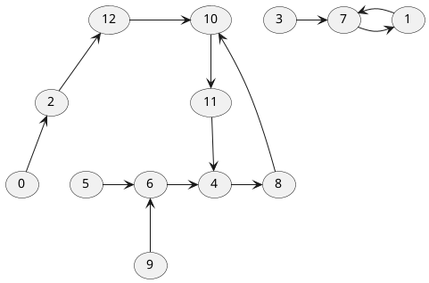

---
export_on_save:
    puppeteer: ["pdf"]
puppeteer:
    height: "3.7in"
    width: "5in"
    pageRanges: "1"
---

```puml
@startuml

(3) -> (7)
(12) -> (10)
(0) -up-> (2)
(11) -down-> (4)
(8) -> (10)
(9) -up-> (6)
(2) -up-> (12)
(5) -> (6)
(7) -> (1)
(10) -down-> (11)
(6) -> (4)
(4) -> (8)
(1) -> (7)

@enduml
```