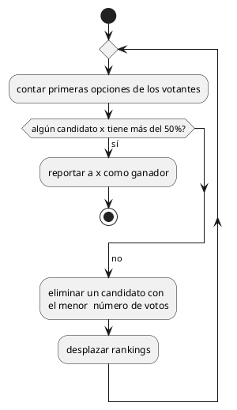

---
export_on_save:
    puppeteer: ["pdf"]
puppeteer:
    height: "4.3in"
    width: "3in"
    pageRanges: "1"
---

```puml
@startuml
start

repeat
    :contar primeras opciones de los votantes;

    if (algún candidato ""x"" tiene más del 50%?) then (sí)
        :reportar a ""x"" como ganador;
        stop
    endif

    ->no;

    :eliminar un candidato con\nel menor  número de votos;
    :desplazar rankings;


@enduml
```