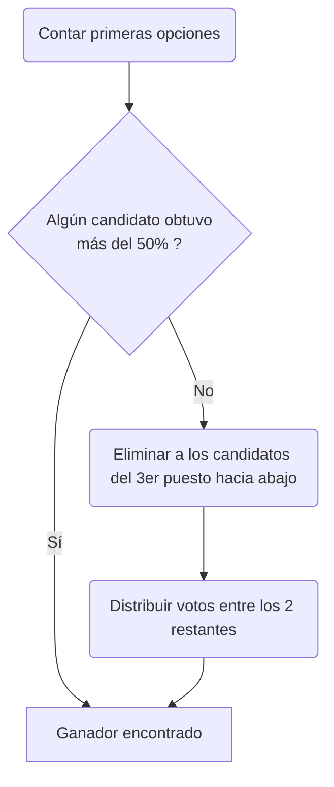

---
puppeteer:
    height: "8in"
    width: "5in"
    pageRanges: "1"
---

```mermaid
graph TD
   A(Contar primeras opciones) --> B{Algún candidato obtuvo <br/> más del 50% ?}
   B --> |Sí| C[Ganador encontrado]
   B --> |No| D(Eliminar a los candidatos del 3er puesto hacia abajo)
   D --> E(Distribuir votos entre los 2 restantes)

   E --> C
```