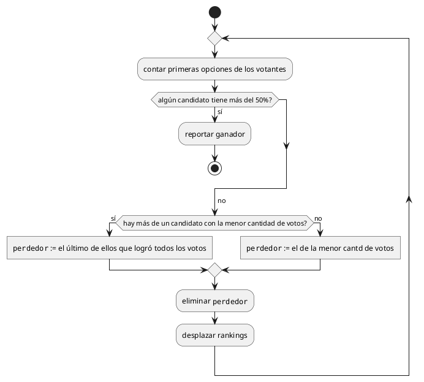

```puml
@startuml
start

repeat
    :contar primeras opciones de los votantes;

    if (algún candidato tiene más del 50%?) then (sí)
        :reportar ganador;
        stop
    endif

    ->no;

    if (hay más de un candidato con la menor cantidad de votos?) then (sí)
        :""perdedor"" := el último de ellos que logró todos los votos]
    else (no)
        :""perdedor"" := el de la menor cantd de votos]
    endif

    :eliminar ""perdedor"";
    :desplazar rankings;

@enduml
```