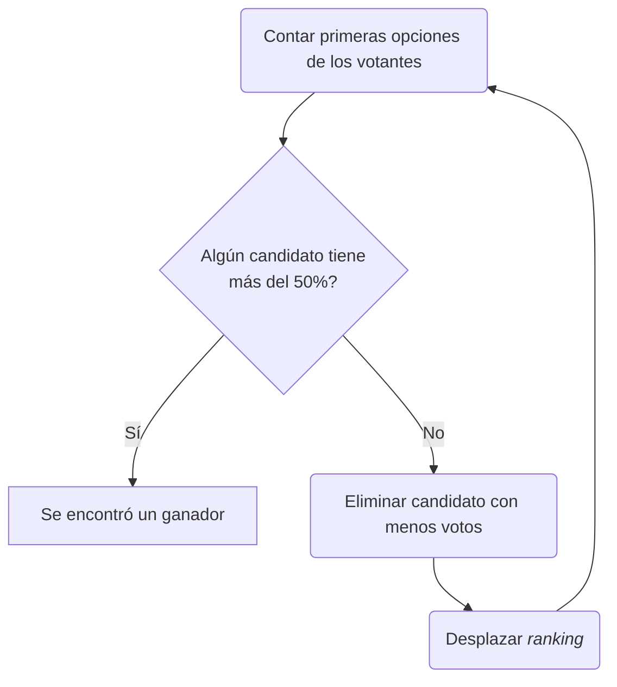

---
puppeteer:
    height: "6.7in"
    pageRanges: "2"
---

```mermaid
graph TD
    A(Contar primeras opciones de los votantes) --> B{Algún candidato tiene <br/> más del 50%?}
    B --> |Sí| C[Se encontró un ganador]
    B --> |No| D(Eliminar candidato con menos votos)
    D --> E(Desplazar <i>ranking</i>)
    E --> A
```
