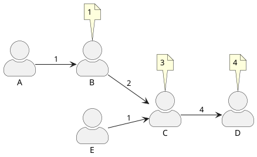

---
puppeteer:
    height: "2.7in"
    width: "4in"
    pageRanges: "1"
---

```puml
@startuml
skinparam actorStyle awesome
left to right direction

:A: --> :B: : 1
:B: --> :C: : 2
:E: --> :C: : 1
:C: --> :D: : 4

note top of B: 1

note top of C: 3
note top of D: 4

@enduml
```
