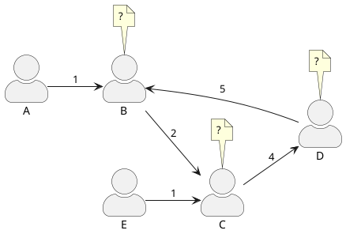

---
puppeteer:
    height: "3in"
    width: "4in"
    pageRanges: "1"
---

```puml
@startuml
skinparam actorStyle awesome
left to right direction

:A: --> :B: : 1
:B: --> :C: : 2
:E: --> :C: : 1
:C: --> :D: : 4
:D: --> :B: : 5

note top of B: ?
note top of C: ?
note top of D: ?

@enduml
```