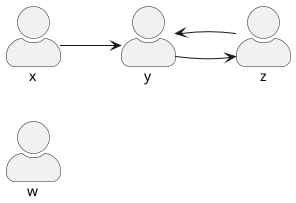

---
puppeteer:
    height: "2.3in"
    width: "3in"
    pageRanges: "1"
---

```puml
@startuml
skinparam actorStyle awesome
left to right direction

:w:
:x: --> :y:
:y: --> :z:
:z: --> :y:

@enduml
```
