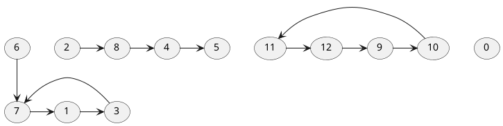

---
export_on_save:
    puppeteer: ["pdf"]
puppeteer:
    height: "2.8in"
    pageRanges: "2"
---

```puml
@startuml

(7) -> (1)    
(2) -> (8)    
(8) -> (4)    
(3) -> (7)    
(11) -> (12)  
(9) -> (10)   
(4) -> (5)    
(12) -> (9)   
(1) -> (3)    
(10) -> (11)  
(6) -down-> (7)    
(0)

@enduml
```